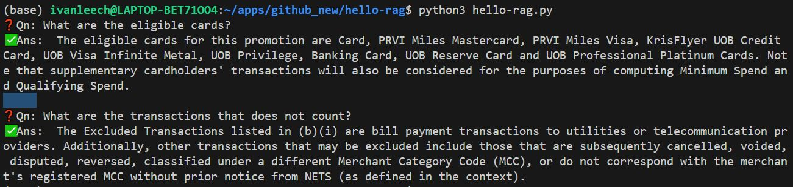

# hello-rag: run RAG w FAISS & langchain in 2 simple steps! 🚀


### Step 1: Download Chat LLM
Download chat LLM model([zephyr-7b-beta.Q4_K_M.gguf](https://huggingface.co/TheBloke/zephyr-7B-beta-GGUF/tree/main)) from huggingface. The GGUF format is suitable for CPU usage.
The model at point of writing is one of the best performing LLM model with 7B parameters.

[](https://huggingface.co/TheBloke/zephyr-7B-beta-GGUF/tree/main)


### Step 2: Install requirements and run the code
```
pip install -r requirements.txt
python3 hello-rag.py
```


### Sample Qn and Ans from the Chat LLM.
You can find the ingested document at [uob.pdf](./assets/uob.pdf).
This document is embeded into the FAISS index as vectors. The vectors related to the prompt from users are retrieved to generate the response.


